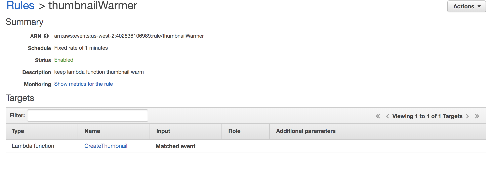
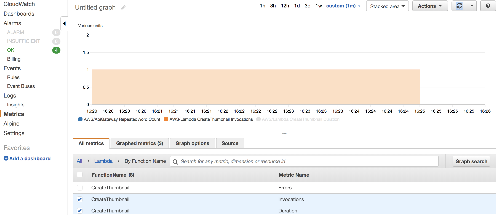
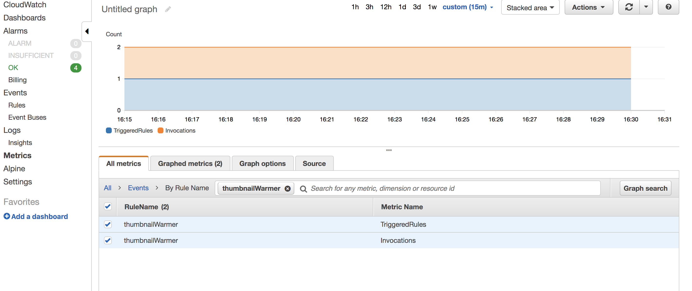

# Task Master
It’s a task-tracking application with the same basic goal as Trello: 
allow users to keep track of tasks to be done and their status. 

## Deploying link
- Link for taskmaster backend: http://taskmaster.us-west-2.elasticbeanstalk.com
- Deploy link fro taskmaster frontend: http://taskmaster-lab31.s3-website-us-west-2.amazonaws.com

## Issues encountered during deployment
- We used to use the RDS as the database to support applications. But this time we are 
using NoSQL. I am not sure how to make the application connect to DynamoDB.

- 10 July 2019: First of all, I had no idea how to send the resized image url to database. Thanks for Evan's help. According to 
full size image url, create resized image url and save to database. After that, there was another issue with my browser-chrome.
Somehow Chrome created my form in a sandbox and blocked the image I try to upload. I cleaned my browser history and restart 
the browser. The issue got fixed. Another issue, when I upload an image in frontend, I could not see the resized image because 
S3 block the access to read. 

## Features
- 4 July 2019:

  - GET /tasks - get a list of all tasks currently in the database.

  - POST /tasks - add a new task to the database - add title, description and assignmee.

  - PUT /tasks/{id}/state - update the state of the tasks. State advances from Assigned -> Accepted -> Finished

## ChangeLog
- 4 July 2019
  - GET /users/{name}/tasks 
    - Representing all of the tasks assigned to that user.
  - PUT /tasks/{id}/assign/{assignee} 
    - Assign a particular user to a task.
  
- 9 July 2019
  - Post /tasks/{id}/images 
    - Users should be able to upload images that are associated with tasks.
  - Get /tasks/{id}  
    - Tasks should also include the image URLs associated with that image.
    
- 10 July 2019 
  - When an image is uploaded to your S3 bucket, it should trigger a Lambda function. (That Lambda function may be 
  written in Note.js.)
  - That function should create a 50x50 pixel thumbnail version of that image, and save it to another S3 bucket.
  - When the server receives the full size image, save the resized image url to database too.  
  
- 12 July 2019
    - create a CloudWatch timer to help keep lambda function - CreateThumbnail alive
 
 
 